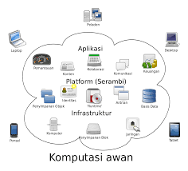
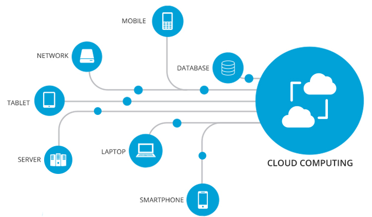

# Cloud Computing

<!--StartFragment-->

**Cloud computing** jika terjemahkan secara harfiah berarti 'komputasi awan'. Dalam hal ini yang **dimaksud** adalah proses komputerisasi sebuah teknologi yang berbasis internet. Sistem **cloud computing** memungkinkan penggunanya untuk menyimpan dan mengolah data secara virtual.<!--StartFragment-->

**Model – Model Cloud Computing**

1. Private **Cloud**. Private **Cloud** adalah penggunaan dari **teknologi Cloud** ini hanya digunakan oleh satu organisasi atau perusahaan **saja** secara private.
2. Community **Cloud**. Community **cloud** digunakan biasanya untuk penggunaan bagi komunitas, institusi atau organisasi. 
3. Public **Cloud**.
4. Hybrid **Cloud**.

<!--EndFragment-->

<!--EndFragment-->

<!--StartFragment-->

Cloud Computing ini diciptakan oleh **J.C.R. Licklider** yang kemudian menjadi penanggung jawab atas pembangunan Advanced Research Projects Agency Network (ARPANET) tepatnya pada tahun 1969

<!--EndFragment-->